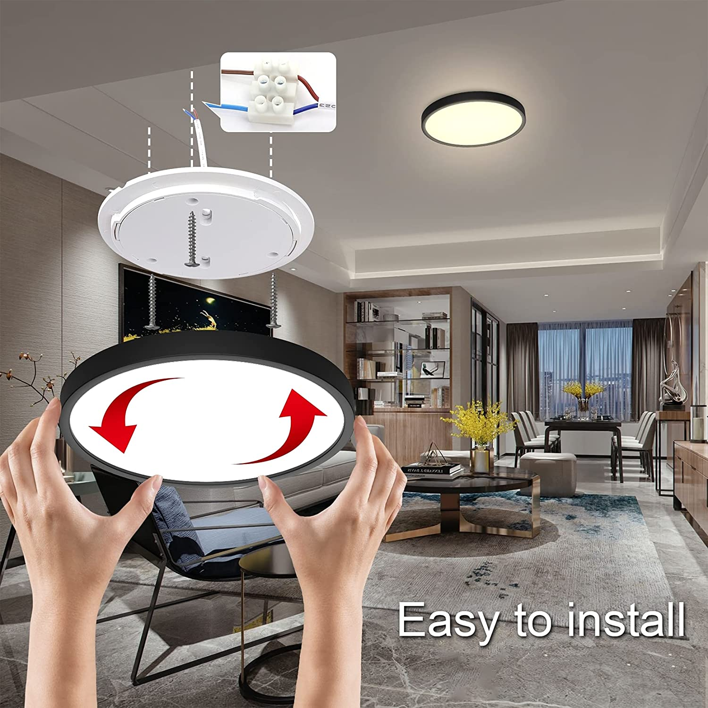
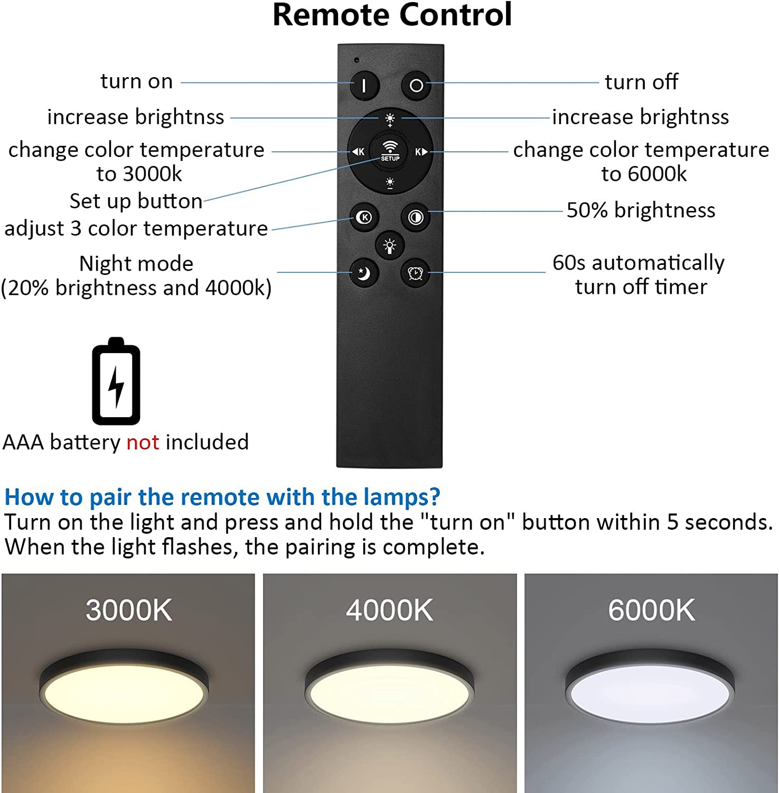

# BLELightsNoPairing

This repo will have my results on reverse engineering some LED Lights I got off Amazon a while ago. My intention is to link these lights to HomeAssistant using a BLE device (ESP32 or the same Raspberry Pi 4 if i'm lucky)

# The Lights

The LED Lights are some indoor white LED lighting (Not RGB) with the ability to change the colour temperature and brightness. I went for this, but there are other similar models

They are sold under many different brand names, but they have similar characteristics:
- Wall/Ceiling mounted, usually with a plate that is screwed onto the wall and the actual light being clipped onto that plate.
- Anywhere between 18 and 36W, with 24W being the most common
- Controlled with a remote
- Dimmable (with said remote) and also able to change temperature colour
These lights come with a remote to change the brightness, temperature, and a few other functions. Here's the remote on my lights:

I haven't checked with other lights but I would guess they use a similar remote, most likely, they are using the same circuitry for both the lights and the remote, but they're just packaging it differently.

# The problem

The remote is not an IR remote like many LED strips use, but rather a BLE (Bluetooth Low Energy) device. The lights themselves however don't show up when you try to scan for bluetooth devices, and they don't have any button or anything to switch them to pairing mode.

# How "pairing" works for these lights:

When the lights are *powered on*, holding the "turn on" button will make the lights blink after ~3 seconds. From that moment, the remote is paired with that light.
If you have multiple, you can repeat the same process, eventually linking the same remote to a few different lights, so that the settings are all shared between them.

Alternatively, this same method can be used to link a phone using the [Lamp Smart App](https://play.google.com/store/apps/details?id=com.alllink.smart_lighting&hl=en&gl=GB) to those lights.

Note that when I say *powered on* I mean when the power switch (the switch on the wall) is flipped off and then back on again, not when the lights are turned off with the remote.

# Discoveries

I've used Wireshark and an nrf5240UA Dongle to scan the packets the remote sends.

- Rather than having the lights be in discoverable mode, it seems that the lights are simply scanning for certain advertising packets at all times. I have tried to reverse engineer the packets sent by one of the remotes:
- It seems only two remotes can be "paired" with the light. Trying to add a third one makes the lights "forget" the previous one (but can easily be re-paired again). I'm using "pairing" lightly here, as I suspect it's not actual pairing but simply the lights storing some unique ID related to each remote.

- Using NRFConnect, I can set up the dongle as advertiser, 50ms advertising interval, and the packets will make the lights react accordingly.
- For the "mode" button in the remote, the remote itself is the one doing the "cycling", each mode has a distinct code associated with it.

After grabbing data from 3 different remotes:

- First Byte: "Type" is 0xFF -> Turns out this isn't actually needed, first two bytes will always be 0x1EFF
- Following bytes: 0x5655
- The next bytes are as follows:
  - 11 bytes of static data: 188752b65f2b5e00fc3151 -> Same for every remote
  - 1 Byte for the "Function":
    - 0xD0 for "ON"
    - 0x50 for "OFF"
    - 0x5C for "Change Mode" -> It seems that "FullBrightness" and "Half Brightness" are both in the same class as "Mode cycle" (Middle button)
    - 0x1C for "Night mode" -> This button goes to minimum brightness and colour temperature
  - 2 Bytes: -> Possibly a "unique address" for each remote
    - 0x3F94, 0x729C or 0xF097. Possibly random, these are the ones I have
  - 3 Bytes: -> Related to each specific function
    - FULLPOWER: Always 0xF7DBCB
    - HALFPOWER: Always 0xF6DACB
    - MODES:
      - 0x08DBCB
      - 0xF724CB
      - 0xF7DBCB
    - NIGHTMODE, ON and OFF: Always 0x0824CB 
  - 1 Byte: -> Possibly some checksum or just random data. Completely different on each button press -> Seems like lower nibble is more or less constant for each function
  - 1 Byte: -> Related to each specific function
    - FULLPOWER: Always 0xBC
    - HALFPOWER: Always 0x7C
    - MODES: Always 0xFE
    - NIGHTMODE, ON and OFF: Always 0xFC
  - 6 Bytes: -> Possibly some checksum or just random data. Completely different on each button press
  - 2 Bytes: -> Always 0x6057

# ESP32

I'm working on an implementation for ESP32. Ideally I'll be able to integrate it directly with Home Assistant through ESPHome Custom Component.
Currently, the proof of concept is succesful: I can turn off one of the lights by cloning the advertisement data from an already paired remote.

References:
https://github.com/nkolban/esp32-snippets/blob/master/cpp_utils/BLEAdvertising.cpp

https://gitter.im/espressif/arduino-esp32?at=5f2c519f107f3a0efab25f42 -> Many thanks to chegewara and RW, their examples were essential to getting this project working.